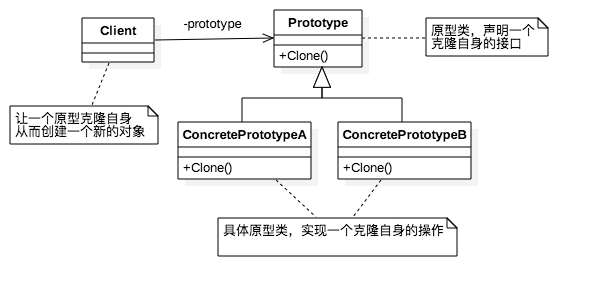

# 原型模式

用原型实例指定创建对象的种类，并且通过拷贝这些原型创建新的对象。

## 定义

用原型实例指定创建对象的种类，并且通过拷贝这些原型创建新的对象。`Prototype`原型模式是一种创建型设计模式，`Prototype`模式允许一个对象再创建另外一个可定制的对象，根本无需知道任何如何创建的细节,工作原理是:通过将一个原型对象传给那个要发动创建的对象，这个要发动创建的对象通过请求原型对象拷贝它们自己来实施创建。它主要面对的问题是：“某些结构复杂的对象”的创建工作；由于需求的变化，这些对象经常面临着剧烈的变化，但是他们却拥有比较稳定一致的接口。

## 原型模式的基本实现



上图是最基本的原型模式的结构图，下面将用**Swift**代码来实现一个基本原型模式：

```swift
// 定义一个原型协议
protocol Prototype {
    var id: String { get }
    func clone() -> Prototype
}

// 原型的具体对象
class ConcretePrototypeA: Prototype {
    var id: String = ""
    // 实现克隆的具体操作
    func clone() -> Prototype {
        let p = ConcretePrototypeA()
        p.id = id
        return p
    }
}
```

不知道大家有没哟发现，这个设计模式我们在代码中经常会用到，那就是`NSCopying`协议，通过这个协议来实现对象的深拷贝，下面我们就用`NSCopying`来实现一下。

## 原型模式解决实际问题（NSCopying）

```swift
import Foundation

class Resume: NSCopying {
    
    var name: String
    var sex: String
    var age: String
    var company: String
    
    init(name: String, sex: String, age: String, company: String) {
        self.name = name
        self.sex = sex
        self.age = age
        self.company = company
    }
    
    func disPlay() {
        print("name: \(name), sex: \(sex), age: \(age), company: \(company)")
    }
    
    func copy(with zone: NSZone? = nil) -> Any {
        return Resume(name: name, sex: sex, age: age, company: company)
    }
}
```

上面是通过`NSCopying`来实现原型模式的例子，一下是使用过程：

```swift
let wcl = Resume(name: "wcl", sex: "male", age: "23", company: "beijing")
let scy = wcl.copy() as! Resume
scy.name = "scy"
scy.sex = "female"
wcl.disPlay()
scy.disPlay()
```

以下是打印的结果:

```
name: wcl, sex: male, age: 23, company: beijing
name: scy, sex: female, age: 23, company: beijing
```

> 以上是我对于原型模式的理解，如果有不对的地方欢迎大家交流，最后谢谢大家的阅读~~