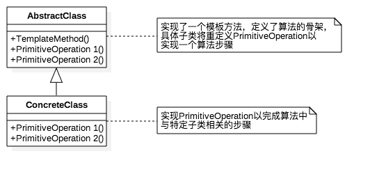
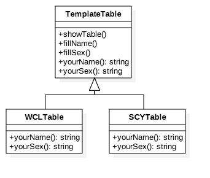

# 模板方法模式

模板方法模式，定义一个操作中算法的骨架，而将一些步骤延迟到子类中。模板方法使得子类可以不改变一个算法的结构即可重定义该算法的某些特定步骤。

## 模板方法模式的基本实现



上图是基本模板模式的UML图，这种设计模式在很多地方都有用到，下面是基本实现的代码：

```swift
class AbstractClass {
    func primitiveOperation1() {}
    func primitiveOperation2() {}
    
    func templateMethod() {
        primitiveOperation1()
        primitiveOperation2()
    }
}

class ConcreteClassA: AbstractClass {
    override func primitiveOperation1() {
        print("具体类A方法1实现")
    }
    
    override func primitiveOperation2() {
        print("具体类A方法2实现")
    }
}

class ConcreteClassB: AbstractClass {
    override func primitiveOperation1() {
        print("具体类B方法1实现")
    }
    
    override func primitiveOperation2() {
        print("具体类B方法2实现")
    }
}
```

## **模板方法模式解决实际问题（填表格）**

在生活中很多地方用到的模板方法模式，比如我们填一份表格，我们要按照表格的模板开始填，只需要填关键部分，而不用将表格的所有文字炒一遍，下面是UML和代码：



```swift
// 表格的模板
class TemplateTable {
    func showTable() {
        fillName()
        fillSex()
    }
    
    func fillName() {
        print("你的名字：\(yourName())")
    }
    
    func fillSex() {
        print("你的性别：\(yourSex())")
    }
    
    func yourName() -> String {
        return ""
    }
    
    func yourSex() -> String {
        return ""
    }
}

// wcl填写的表格
class WCLTable: TemplateTable {
    override func yourName() -> String {
        return "wcl"
    }
    
    override func yourSex() -> String {
        return "male"
    }
}

// scy填写的表格
class SCYTable: TemplateTable {
    override func yourName() -> String {
        return "scy"
    }
    
    override func yourSex() -> String {
        return "female"
    }
}
```

下面我们调用一下代码：

```swift
let wcl = WCLTable()
wcl.showTable()
let scy = SCYTable()
scy.showTable()
```

 下面是调用的结果：

```swift
你的名字：wcl
你的性别：male
你的名字：scy
你的性别：female
```

## 模板方法模式的特点

模板方法模式是通过把不变行为搬移到超类，去除子类中重复代码来体现它的优势，它提供了一个很好的代码复用平台。

> 以上是我对模板方法模式的理解，如果有不对的地方欢迎大家交流，最后谢谢大家的阅读~~